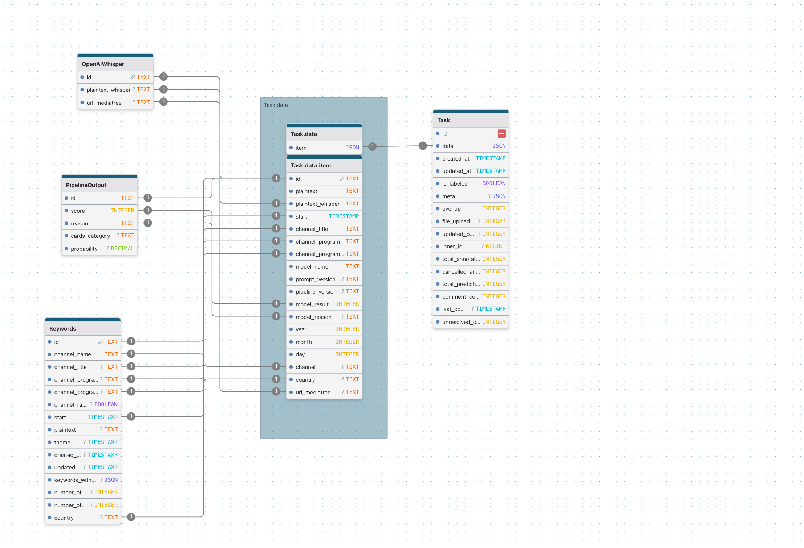

# Data Processing

## Description
1) Firstly the job checks if there is already data for a given date/channel in the target s3 bucket. If data is already present the date will be skipped.
2) For the same date/channel, the job will query the ids in labelstudio for the same combination in order to creating double entries with manually entered data. This is obtained from the `task` table in the `labelstudio` database.
3) Data is queried from the `keywords` table in the `barometre` database, with the exception of ids already present in `task`.
4) If no new data is present an `empty.txt` file is saved in the target s3 bucket at `country={country.name}/year={year}/month={month}/day={day}/channel={channel}/empty.txt`.
5) If new data is present, the transcripts are classified by a model/LLM as climate misinformation or not.
6) Transcripts classified as misinformation are kept and the mp3 data for the corresponding media chunk is pulled from mediatree. OpenAI Whisper uses the mp3 audio track in order to produce a high quality transcript that will be used for manual annotation.
7) The data is then saved to the s3 bucket corresponding to the country.

## Database Diagram
