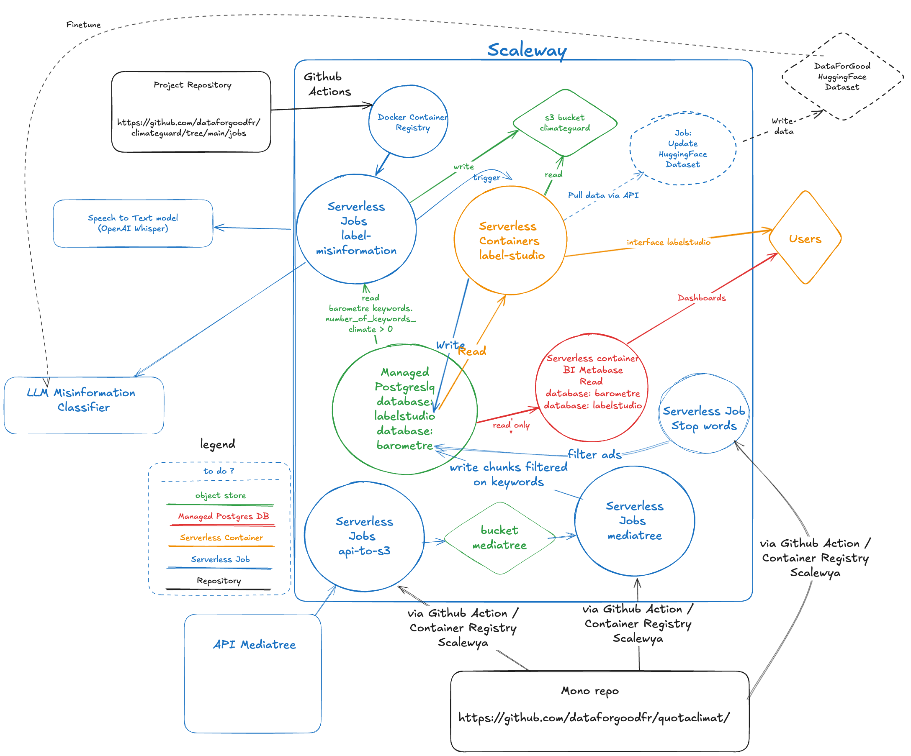

# Project Infrastructure
The following document illustrates the different tools that have been deployed on the project.

## Functional Desciption
1) Commits on main trigger a GitHub action that tests, builds, pushes the docker images to the scaleway container registry and updates the serverless job definitions.
2) The `api-to-S3` job calls the mediatree API and dumps the data on in the `mediatree` bucket. 
3) The `mediatree` serverless job loads the data from the bucket into the `barometre` database.
4) The `stopwords` job removes ads from the media chunks, to keep only program content.
5) The `label-misinformation` job calls the calls a model to classify the chunk texts. The texts that are classified as misinformation have their audio re-transcribed as a high quality transcript using OpenAI Whisper. They are then save in the bucket corresponding to the country.
6) The `label-misinformation` job finally calls the labelstudio sync API in order to the labelling projects with the source buckets.
7) Transcripts are saved as 'tasks' in labelstudio. The annotators can then annotate the data through the labelstudio interface.

## Deployments

### Managed Postgres Databases
* `barometre`: Database of the observatoire du climat.
* `labelstudio`: Container the storage backend for the functioning of labelstudio. Stores users, tasks, task completions, API tokens and S3 storage connections.

### Buckets
* `climateguard`: Store for identified records from the model for the country France. Syncs with labelstudio in order to load tasks in the labelstudio db.
* `climateguard-brazil`: Store for identified records from the model for the country Brazil. Syncs with labelstudio in order to load tasks in the labelstudio db.
* `mediatree`: Stores the data imported from the mediatree API. This is the same data that is loaded into the barometre database.

### Scaleway docker registry
* `misinformation/label-misinformation`: docker registry for the `label disinformation` job.
* `namespace-barometre/s3`: docker registry for the `api-to-s3` job.
* `namespace-barometre/mediatree-import`: docker registry for the `mediatree` job.
* `namespace-barometre/stopwords`: docker registry for the `stopwords` job.

### Serverless containers 
* `metabase`: Exposes the BI interface Metabase.
* `labelstudio`: Exposes the labelling interface LabelStudio. 

### Serverless Jobs
* `api-to-s3`: Calls the mediatree API and writes the data to s3
* `mediatree`: Loads the media chunk data from S3 to the barometre database, where it can be expolited.
* `stopwords`: Removes ad segments from data being loaded in the barometre database.
* `label-misinformation`: This is the main app linked to the project. It queries the `keywords` table in `barometre`, recovering media chunks. It then calls an LLM to classify the transcripts as misinformation or not. The texts classified as disinformation are re-transcribed using OpenAI Whisper and loaded on S3 to be synced with labelstudio.

## Architecture
